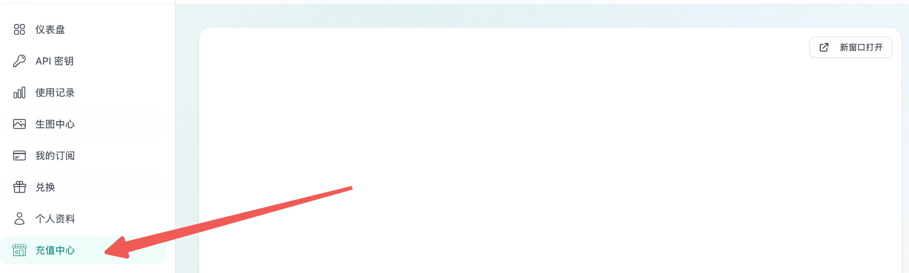
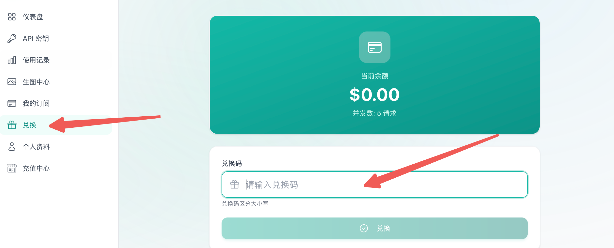
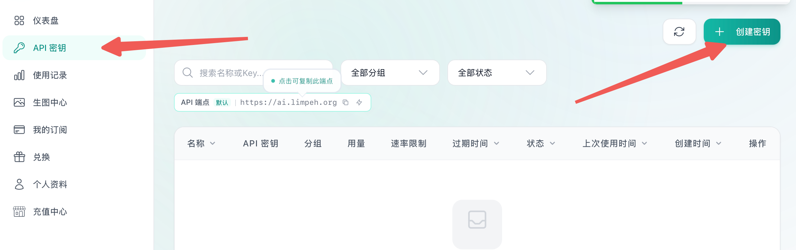
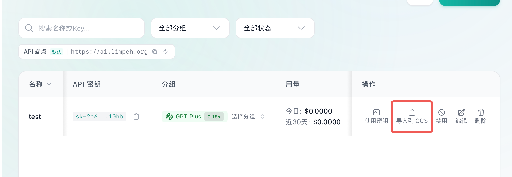
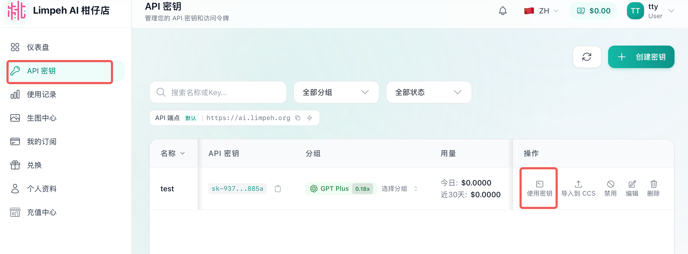

# 快速入门

这份手册面向普通用户。你只需要完成三件事：充值并兑换余额、创建 API 密钥、配置一个客户端。

## 1. 使用流程

最短路径如下：

1. 登录平台。
2. 在【充值中心】购买兑换码。
3. 在【兑换】中兑换余额。
4. 在【API 密钥】中创建 API 密钥，并选择所属分组。
5. 配置客户端。
6. 打开你选择的客户端开始使用。

你不需要配置所有客户端。Codex App、VS Code + Codex 插件、Codex CLI 等客户端，选择其中一种即可。

## 2. 充值并兑换余额

当前平台使用余额作为调用额度。购买兑换码后，还需要手动兑换，余额才会到账。

操作步骤：

1. 打开侧边菜单【充值中心】。
2. 购买需要的兑换码。
3. 打开侧边菜单【兑换】。
4. 粘贴兑换码并提交。
5. 返回首页或余额页面，确认余额已增加。

如果购买后余额没有变化，请先确认是否已经完成【兑换】。

## 3. 创建 API 密钥

API 密钥是客户端调用服务时使用的凭证。

操作步骤：

1. 打开侧边菜单【API 密钥】。
2. 点击【创建密钥】。
3. 填写名称，方便自己识别用途。
4. 选择 API 密钥的所属分组。
5. 创建后立即复制并保存 API 密钥。

所属分组决定这个 API 密钥可以使用哪些模型或服务。

## 4. 配置客户端

配置客户端分两步：

1. 先写入配置。
2. 再打开你要使用的软件。

推荐使用【导入到 CCS】自动写入配置。熟悉配置文件的用户，也可以通过【使用密钥】手动复制配置。

### 4.1 推荐方式：导入到 CCS

【导入到 CCS】会尝试唤起 CC Switch，并自动导入当前 API 密钥配置。推荐大多数用户优先使用这种方式。

操作步骤：

1. 打开【API 密钥】页面。
2. 找到要使用的 API 密钥。
3. 点击该行的【导入到 CCS】。
4. 按浏览器或 CC Switch 的提示完成导入。
5. 导入完成后，再打开你要使用的客户端。

如果提示 CC Switch 未安装或无法打开，请先安装 [CC Switch](https://github.com/farion1231/cc-switch)，或改用下面的手动方式。

### 4.2 手动方式：复制配置文件

如果你不使用 CC Switch，可以手动复制配置。

操作步骤：

1. 打开【API 密钥】页面。
2. 点击对应密钥的【使用密钥】。
3. 选择你的客户端标签，例如 Codex CLI、Claude Code、Gemini CLI 或 OpenCode。
4. 根据系统选择 macOS/Linux 或 Windows。
5. 点击复制，把内容粘贴到页面提示的配置文件中。
6. 保存配置文件后，再打开客户端。

如果你不熟悉终端或配置文件，建议使用【导入到 CCS】。

## 5. 选择一个客户端

你只需要选择自己要用的一种客户端。

### 5.1 Codex App（Windows / macOS）

适合普通用户。先完成配置，再打开 [Codex App](https://chatgpt.com/zh-Hans-CN/codex) 使用。

如果需要手动填写，请使用平台提供的 Base URL、API 密钥和模型名。

### 5.2 VS Code + Codex 插件

适合在 VS Code 中开发的用户。先完成配置，再打开或重载 VS Code。

### 5.3 Codex CLI（进阶用户，可跳过）

Codex CLI 更适合熟悉命令行和配置文件的用户。非专业用户可以跳过本节，优先使用 Codex App 或 VS Code 插件。

## 6. 使用前检查

打开客户端前，确认下面几项已经完成：

- 余额已经到账。
- API 密钥已经创建。
- API 密钥已选择所属分组。
- 配置已经写入 CC Switch 或配置文件。
- 你只打开了自己要使用的那个客户端。

## 7. 安全提醒

- 不要把 API 密钥发给别人。
- 不要把 API 密钥提交到公开仓库。
- 怀疑泄露时，立即删除旧密钥并重新创建。
- 联系支持时，请提供账号邮箱、客户端名称、模型名和截图，不要发送完整 API 密钥。
